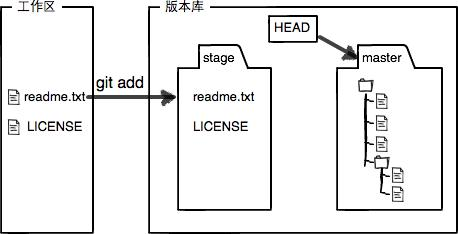

#                                                                                                                                                                                   .git的基本用法

vs使用git:https://segmentfault.com/a/1190000016593233

sourcetree 提交记录可视化

1. git branch -a git branch -r 看远程分支

2. git checkout /checkout -b

3. git merger 

4. git push 

5. git rebase 

6. git fetch --all

   

[git教程](https://www.liaoxuefeng.com/wiki/896043488029600)

[git文档](https://www.yiibai.com/git/git_config.html)


```
git init 初始化仓库
git remote add origin git@github.com:michaelliao/learngit.git 本地连接远程厂库
git add .
git commit -m '提交记录'
git push origin dev2 把本地库的内容推送到远程
```

#### [版本库（Repository）](https://www.liaoxuefeng.com/wiki/896043488029600/896954074659008)

工作区有一个隐藏目录`.git`，这个不算工作区，而是Git的版本库。

Git的版本库里存了很多东西，其中最重要的就是称为stage（或者叫index）的暂存区，还有Git为我们自动创建的第一个分支`master`，以及指向`master`的一个指针叫`HEAD`。


第一步是用`git add`把文件添加进去，实际上就是把文件修改添加到暂存区；



第二步是用`git commit`提交更改，实际上就是把暂存区的所有内容提交到当前分支。


[分支管理](https://www.liaoxuefeng.com/wiki/896043488029600/896954848507552)

head指向当前分支 切换分支修改head的指向, 提交代码head指向最新的修改点

[标签](https://www.liaoxuefeng.com/wiki/896043488029600/900788941487552)

上线某个commit的版本 只能找到id tag绑定commit的id 然后push tag版本 tag只存储在本地

## 1.branch分支

- 查看分支 

  ```
  git branch #查看本地分支 -a (all)所有分支 -r (remote)远程分支 
  ```

- 新建分支

  ```
  git branch [newBranchName]
  ```

- 修改分支

  ```
  git branch -m old new #新建分支
  ```

  

- 删除分支

  ```
  git branch -d [BranchName] #删除本地分支  d等价delete 
  git push origin --delete [BranchName] #刪除远程分支
  https://blog.csdn.net/qq_32452623/article/details/54340749
  ```

## 2.checkout

https://www.cnblogs.com/hutaoer/archive/2013/05/07/git_checkout.html?utm_source=tuicool

checkout别名 https://cloud.tencent.com/developer/ask/147659

```
git config --global alias.co checkout
```

```
git checkout-b ['分支'] 创建并切换分支
git chekout 切换分支
git checkout --merge <branch> 切换分支并合并
```


## 3.merge: 命令用于将两个或两个以上的开发历史加入(合并)一起 

git merge target branch

```
git merge fixes enhancements
 git merge -s ours obsolete
 git merge --no-commit maint
  git merge dev
```


## 4.commit:实际上就是把暂存区的所有内容提交到当前本地分支。

```
git commit -m 'info'
```


## 5.release:命令在另一个分支基础之上重新应用，用于把一个分支的修改合并到当前分支。

```
git rebase branch
```


## 6.pull: 取回远程主机某个分支的更新，再与本地的指定分支合并 

```
git pull [options] [<repository> [<refspec>…]]
$ git pull <远程主机名> <远程分支名>:<本地分支名>
$ git pull origin next:master //要取回origin主机的next分支，与本地的master分支合并
git pull origin next //如果远程分支(next)要与当前分支合并，则冒号后面的部分可以省略。
```

## 7.push: 用于将本地分支的更新，推送到远程主机 

[push详解](https://www.cnblogs.com/qianqiannian/p/6008140.html)

```
git push <远程主机名> <本地分支名>:<远程分支名>
git push --all origin
git push不会推送标签(tag)，除非使用–tags选项
git push origin --tags
git push origin master 将本地的master分支推送到origin主机的master分支
git push origin :master 如果省略本地分支名，则表示删除指定的远程分支
# 等同于
$ git push origin --delete master
 git push --all origin 当遇到这种情况就是不管是否存在对应的远程分支，将本地的所有分支都推送到远程主机，这时需要 -all 选项
 git push --force origin git push的时候需要本地先git pull更新到跟服务器版本一致，如果本地版本库比远程服务器上的低，那么一般会提示你git pull更新，如果一定要提交，那么可以使用这个命令。
  git push origin --tags //git push 的时候不会推送分支，如果一定要推送标签的话那么可以使用这个命令
```


## 8.fetch： 命令用于从另一个存储库下载对象和引用 

```
git fetch <远程主机名>  将某个分支拉倒本地
git fetch			 拉所有分支到本地
git fetch <远程主机名> <分支名>  取回origin主机的master分支。
```


## 9.remote:本地连接仓库连接远程

```
git remote add [shortname] [url] 添加新的远程分支
git remote add origin http://172.20.0.250/vue-supplier-admin/vue-supplier-admin
git remote 查看远程分支
git remote -v (verbose) 显示克隆的地址
```

## 10.add:文件修改添加到暂存区

```
通常是通过git add <path>的形式把<path>添加到索引库中，<path>可以是文件也可以是目录。
git add . #省略path .表示当前目录 提交所有文件
git add document/* .txt 添加document目录和其目录下的所有.txt文件
$ git add *  # Ant风格添加修改
$ git add *Controller   # 将以Controller结尾的文件的所有修改添加到暂存区

$ git add Hello*   # 将所有以Hello开头的文件的修改添加到暂存区 例如:HelloWorld.txt,Hello.java,HelloGit.txt ...

$ git add Hello?   # 将以Hello开头后面只有一位的文件的修改提交到暂存区 例如:Hello1.txt,HelloA.java 如果是HelloGit.txt或者Hello.java是不会被添加的
git add -A: []表示把中所有跟踪文件中被修改过或已删除文件和所有未跟踪的文件信息添加到索引库/
git add -u [<path>]: 把<path>中所有跟踪文件中被修改过或已删除文件的信息添加到索引库。它不会处理那些不被跟踪的
git add -i [<path>]命令查看中被所有修改过或已删除文件但没有提交的文件，并通过其revert子命令可以查看<path>中所有未跟踪的文件，同时进入一个子命令系统。
```

## 11.reset: 将当前`HEAD`复位到指定状态   一般用于撤消之前的一些操作(如：`git add`,`git commit`等) 

[理解reset和head](https://segmentfault.com/a/1190000009658888)


```
git log 查看head的位置
head https://segmentfault.com/a/1190000009658888
git reset [ –soft | –mixed | –hard] <commit>
git reset <commit> 的意思就是 把HEAD移到<commit>

git reset <commit> [--] <file>
git reset --mixed <commit> 这个用法就是你可以只针对一个file做出这个指令
第二种的用法只是第一种的一个特例 就是前面的soft/mixed/hard不能指定 使用默认的mixed
如果你commit不给 default就是HEAD, 如果你file不给 default就是整个资料夹
```

## 12.git  shortlog : 汇总git日志 

13. ## git describe 

14. ##  `git status`命令用于显示工作目录和暂存区的状态 

15. ##  `git stash`命令用于将更改储藏在脏工作目录中 

16. ##  `git log`命令用于显示提交日志信息。 

删除2  
git branch -r -d origin/branch-name
git push origin :branch-name
https://blog.csdn.net/furzoom/article/details/53002699

## 

[master合并分支时提示“Already up-to-date”](https://blog.csdn.net/Lc_style/article/details/80897608)

```
git checkout master；
git reset --hard dev;
git push --force origin master

```

## [git 拉取远程分支到本地](https://blog.csdn.net/carfge/article/details/79691360)

```
git remote add origin http 自己要与origin master建立连接
git  fetch origin dev //把远程分支拉到本地
git checkout -b dev(本地分支名称) origin/dev(远程分支名称) //在本地创建分支dev并切换到该分支
git pull origin dev //把某个分支所有内容拉去到本地(是 git fetch 和git merge FRTCH_HEAD的缩写 )
```

[git:fatal: remote origin already exists.](https://blog.csdn.net/dengjianqiang2011/article/details/9260435)

###### [GitHub# fatal: 'origin' does not appear to be a git repository]( https://blog.csdn.net/chaorwin/article/details/51921294 )

git reset --hard dev;

重新拉代码

github提交代码 格子没有变绿

 https://blog.csdn.net/neil4/article/details/53362936 