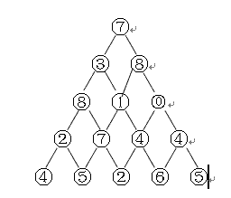

 给定一个未排序的整数数组，找出其中没有出现的最小的正整数。 

```
示例 1:

输入: [1,2,0]
输出: 3
示例 2:

输入: [3,4,-1,1]
输出: 2
示例 3:

输入: [7,8,9,11,12]
输出: 1
```

 **说明:** 你的算法的时间复杂度应为O(n)，并且只能使用常数级别的空间。 

https://mp.weixin.qq.com/s/MgCY9yAEHnYnu4CIy9xILw

 题目描述：给定一个数组A[0,1,…,n-1],请构建一个数组B[0,1,…,n-1],其中B中的元素B[i]=A[0]*A[1]*…*A[i-1]*A[i+1]*…*A[n-1]。不能使用除法。 

https://mp.weixin.qq.com/s/XYYfySRzPtHS6o_fGNr3Sw

帽子问题

https://mp.weixin.qq.com/s/HSDQnBTfOJ6t2fhjFbRrSg

数字三角形，从顶部出发，在每一结点可以选择向左走或得向右走，一直走到底层，要求找出一条路径，使路径上的值的和最大。给出算法的时间复杂度。


如下图例子，数字三角形层数n(1<=n<=100)



https://mp.weixin.qq.com/s/FcVVaXKyWoZFK1porHqmhA

https://mp.weixin.qq.com/s/MgCY9yAEHnYnu4CIy9xILw

## 使用 JavaScript，也能在 Web 应用中实现人脸检测功能？

https://mp.weixin.qq.com/s/tXtN5Yvq5706MzIgffMJjA

## 抽象类和接口到底是什么垃圾——秒懂

https://mp.weixin.qq.com/s/ZH1ryQWs6TYwjQdVEhcgtA

算法

https://mp.weixin.qq.com/s/VUHiaOR55MntjsXN-CXQag

算法

https://mp.weixin.qq.com/s/bdIW8Yq9-Zawy3_gQ5EL6w

算法

https://mp.weixin.qq.com/s/8KHzFYyenDSwrD71divymg

华为

https://mp.weixin.qq.com/s/A2GpHJW248JgLaRC2SjEZQ

算法

## 经典算法题 ：线性结构、完全二叉树等5道题

https://mp.weixin.qq.com/s/maD3XuPCYXhP3wcasnDX6A

互联网学历

https://mp.weixin.qq.com/s/G_0dY8E65vKv8BwX7k-KNQ

## 如何以计算机的方式去思考

https://mp.weixin.qq.com/s/74TqqqblketWcY7okpd_bQ

## 经典算法题 ：删除模式串中出现的字符

https://mp.weixin.qq.com/s/-oPipLPszObkdM87zQ_auA

算法

 https://mp.weixin.qq.com/s/DBQrqi8Vr8bBRrdh-NNBGw 

算法

https://mp.weixin.qq.com/s/p_usgPbpK5hYD9c6pP32oQ

算法

https://mp.weixin.qq.com/s/PIXgs8o96SI-q0ByDTKg0Q

算法

https://mp.weixin.qq.com/s/PfWiNxphK6vTchrrFvDjOg

面试

https://mp.weixin.qq.com/s/4W-mSY5YxMMlxjju1rKpYQ

算法

https://mp.weixin.qq.com/s/JDLg4IFGW5MWI33UagxvPA

算法

https://mp.weixin.qq.com/s/HWgUo6il6UHPhU_w0Bx5aA

算法

https://mp.weixin.qq.com/s/8qLajUXeSfxXsNbEiOIhDg

算法

https://mp.weixin.qq.com/s/o8TMI3qApYBWNEfECjJmrw

算法

https://mp.weixin.qq.com/s/L-i1u0Cw8RaCf6tXoj6KOQ

算法

https://mp.weixin.qq.com/s/UOY2bmohqPmxS6v19-OWUg

算法

https://mp.weixin.qq.com/s/9OO9tx5ntgbU0ddDmXcKOA

红黑树

https://mp.weixin.qq.com/s/RUJ1uYLUhDs1VkSKMkZYaw

算法

https://mp.weixin.qq.com/s/lbU77Iaqg2cmf2XOBMFi0Q

浏览器

https://mp.weixin.qq.com/s/NPFmbEy8xz287tcelxcymw

算法

https://mp.weixin.qq.com/s/cH4G_Y93KxOibjfjd-1mmA

刘强东

https://mp.weixin.qq.com/s/KbEmTDLPBlyaSCXt5N8xhg

算法

https://mp.weixin.qq.com/s/8uVAxnhLv4To_V54cpRwIA


贪心

https://mp.weixin.qq.com/s/LBDWqEZDEkL1R4L_HCLqvw

算法

https://mp.weixin.qq.com/s/fAB1sSO2HLXNRBlatkFrSw

算法

https://mp.weixin.qq.com/s/V6lWud-KNe41JoIyyJDkdw

工程师项目经理差别

https://mp.weixin.qq.com/s/HPAardiIbkQJV04LY8Yzqg

算法

https://mp.weixin.qq.com/s/hKNny49w2WPKxzwJv6-wIw

囚徒困境

https://mp.weixin.qq.com/s/UdH4PQUPvXtIeB6mn8J4fA

算法

https://mp.weixin.qq.com/s/sAfc1sE8suAl1K2fwrypVA

数组链表

https://mp.weixin.qq.com/s/sweknbnBeYlSyi6BlAupZg

算法

https://mp.weixin.qq.com/s/vMym9jMN4GwPuLijkDJLWg

旅行商问题

https://mp.weixin.qq.com/s/AY-xXR-Lzn1uM0XEziYhpA

算法

https://mp.weixin.qq.com/s/fSg-Yg2BNIThTv1SBVPpuQ

算法

https://mp.weixin.qq.com/s/se889E1E4nUtGU_ZaxeO-g

算法

https://mp.weixin.qq.com/s/HMwkhoMaYw2SHbCKW0ftUg

js面试

https://mp.weixin.qq.com/s/MCasOPNn4NHUN9uxlCUeAw

算法

https://mp.weixin.qq.com/s/EZ1k8CzemQpLyfIIYg1e-w

算法

https://mp.weixin.qq.com/s/qsqLTfj9BEZM6xPSTQ-k1w

架构

https://mp.weixin.qq.com/s/JRNSPnzDjy7pRCdNDS_TAA

算法

https://mp.weixin.qq.com/s/JRD1PN8j0DPBzTFgO6WhdQ

算法

https://mp.weixin.qq.com/s/RKIp9qBNv9okT-XtZeQ1tg

2pc

https://mp.weixin.qq.com/s/vI2iYx8Ce9BujAvCCuWBCg

微服务

https://mp.weixin.qq.com/s/aM8MUK88f5FZRVCCCk7B5w

算法

https://mp.weixin.qq.com/s/8jHTDsZnPAJ7uORuhRStsg

算法

https://mp.weixin.qq.com/s/JF7gGvOvXU5jL8SkZW1VUg

算法

https://mp.weixin.qq.com/s/14CTEU4ddzCRjG4sgL8YRA

算法

https://mp.weixin.qq.com/s/ROM5z5WVyfZvE3CH4PrrRQ

算法

https://mp.weixin.qq.com/s/61pHMV9KLLZFH3KuG94Vhg

cookie

https://mp.weixin.qq.com/s/mGadyap0LtfWrIKiRAv0Bw

算法

https://mp.weixin.qq.com/s/BZBntrpZeofrOCJtOL7GXw

i++

https://mp.weixin.qq.com/s/DBd7WCPP2hte5U1x8xG4vw

算法

https://mp.weixin.qq.com/s/0vSmzOh3Fj6XW32iNPdNJg

算法

https://mp.weixin.qq.com/s/QVMG1A1rm_Igi5WBonEqew

算法

https://mp.weixin.qq.com/s/W6_KKDVOOU3P3ORTDx0yHw

摩斯电码

https://mp.weixin.qq.com/s/P_82OpAVNJYCwW66Sk8Qcg

算法

https://mp.weixin.qq.com/s/AXYtTA2co5G3NjcFcKtlnA

算法

https://mp.weixin.qq.com/s/xbA6CuHkToIAxpkgRjwJrQ

算法

https://mp.weixin.qq.com/s/YNo3TEa6nEENP6qN_PUHQw

算法

https://mp.weixin.qq.com/s/V5TxDuOwTaUy6LfdCz8vxg

学历

https://mp.weixin.qq.com/s/h8tZRMg5EI7PsI8PHntzcQ

算法

https://mp.weixin.qq.com/s/Yx8_pb9tiK7R5V7coAVpHA

算法

https://mp.weixin.qq.com/s/JTqeqcHjsZoYeso1mrm1Ww

代码丢弃

https://mp.weixin.qq.com/s/2lGR6vkqGZf6VXmDYzLyHw

算法

https://mp.weixin.qq.com/s/3dyjTpfPaNCd1u1_OdRpeg

算法

https://mp.weixin.qq.com/s/wBurFoyOn5-7lRQyEMqMhQ

算法

https://mp.weixin.qq.com/s/KSE0UzxIFK045h6Qn7bAPA

梦想

https://mp.weixin.qq.com/s/EldAe8sEgbufQo9Rf7NdYA

算法

https://mp.weixin.qq.com/s/lhrUemE4A_CE8EUGkOahVw

算法

https://mp.weixin.qq.com/s/3aMw734ddKy5iAlwzaEm8w